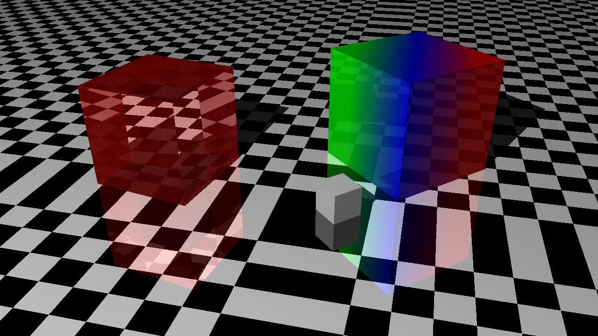
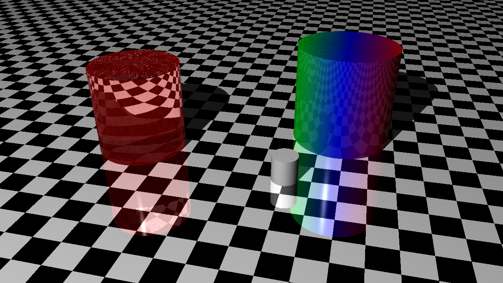

# Chapter 1

Tuples, Points, Vectors

# Chapter 2

Drawing on a canvas

# Chapter 3

Matrices

# Chapter 10

Patterns

To Visit - couple of patterns left out, Ring and Perturbed.

# Chapter 12 - Cubes



# Chapter 13 - Cylinders



# Running

## Testing

```shell
cargo test
```

If doc tests are slow (and there isn't any to test as currently), run:

```shell
cargo test --lib --bins --tests
```

## Benchmarking:

```shell
cargo bench
```

# Editing

## Formatting

```shell
cargo fix --allow-dirty && cargo fmt
```

## Pre commit recommendation

```shell
cargo fix --allow-dirty && cargo fmt && cargo test --lib --bins --tests && cargo run --release -- --all
```

# Animations

Install ffmpeg anyway you like, for example on mac:

```shell
brew install ffmpeg
```

