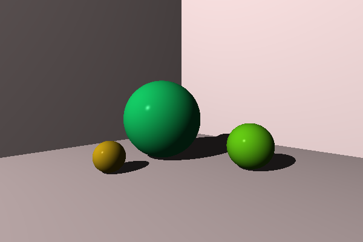

# Chapter 1

Tuples, Points, Vectors

# Chapter 2

Drawing on a canvas

# Chapter 3

Matrices

# Running

## Testing 

```shell
cargo test
```

## Benchmarking:

```shell
cargo bench
```

# Editing

## Formatting

```shell
cargo fix --allow-dirty && cargo fmt
```

## Pre commit recommendation

```shell
cargo fix --allow-dirty && cargo fmt && cargo test && cargo run
```
